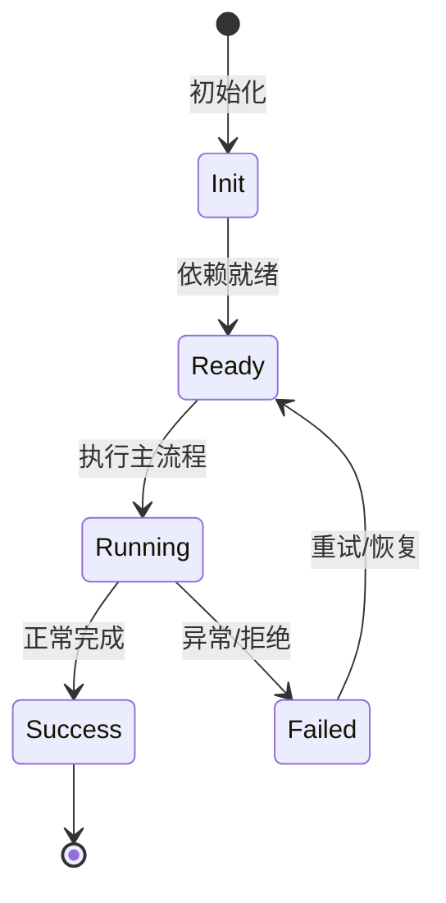

# Agent 主循环

v2 的 loop 由 stepRequest、turnOps、llmRequester、toolExecutor、toolScheduler 等协作完成 Turn/Step。

## 澄清：不是 Plan/Act/Observe/Reflect

NightHawk 并没有实现独立的 Plan/Act/Observe/Reflect 四阶段状态机。实际循环是：

```text
Turn 开始
  → Step：LLM 请求
  → Step：工具执行（0..N 个，可并行）
  → 结果写回 contextMemory
  → 若模型继续请求工具，进入下一个 Step
  → 否则 Turn 结束
```

`Plan` 是用户可选模式，不是循环阶段；`Observe`/`Reflect` 不是独立状态，而是由上下文管理、子 Agent、事件和提示词注入承担。


## 循环入口

用户 prompt 进入 `IAgentPromptService`，构建 step request，交给 `ILoopService` 或 `TurnService` 执行。

## LLM 请求

`agent/llmRequester/llmRequester.ts` 组装消息、工具 schema、thinking 配置，调用 kosong ChatProvider。

## 工具执行

`agent/toolExecutor/toolExecutor.ts` 负责 before/after 事件、veto、approval、执行；`toolScheduler` 处理并行工具。

## 上下文记忆

`agent/contextMemory/` 维护 transcript、消息 id、工具结果渲染、loop event fold、compaction。

## 专业实现要点（开发流程视角）

### 需求分析

架构要支撑多会话、多 agent、可扩展工具、可观测 DI、持久化和安全边界。

### 设计决策

使用四层 Scope 表达状态生命周期；用 Service/Feature/Contribution 替代中心化注册表；用事件和 veto 解耦模块。

### 实现步骤

先实现 `_base/di` 与 `_base/lifecycle`，再建立 App/Workspace/Session/Agent scope，最后把领域能力实现为 Feature。

### 验证方式

通过 `packages/agent-core-v2/test/` 的 scope host 测试、DI 级联测试和 nighthawk-inspect 的可视化验证。

### 维护注意

遵循依赖方向：子 scope 依赖父 scope；App 服务不得持有 session 级 Map 状态。

## 逐函数实现说明

以下按源码文件列出可验证的导出函数/类，并给出实现职责说明。

### packages/agent-core-v2/src/agent/loop/loop.ts

| 函数 | 行号 | 签名 | 实现说明 |
| --- | --- | --- | --- |
| `createMaxStepsExceededError` | 19 | `export function createMaxStepsExceededError(maxSteps: number, message?: string): LoopError {` | `createMaxStepsExceededError` 负责创建/构建相关对象或流程。 |
| `isMaxStepsExceededError` | 28 | `export function isMaxStepsExceededError(error: unknown): boolean {` | `isMaxStepsExceededError` 是本文涉及模块中的一个导出函数/类，具体语义以源码实现为准。 |

| 类 | 行号 | 声明 | 实现说明 |
| --- | --- | --- | --- |
| `LoopError` | 12 | `export class LoopError extends Error2 {` | 该类封装本文模块的核心状态与行为。 |

### packages/agent-core-v2/src/agent/loop/loopContinuationService.ts

| 类 | 行号 | 声明 | 实现说明 |
| --- | --- | --- | --- |
| `AgentLoopContinuationService` | 9 | `export class AgentLoopContinuationService` | 该类封装本文模块的核心状态与行为。 |

### packages/agent-core-v2/src/agent/loop/loopService.ts

| 类 | 行号 | 声明 | 实现说明 |
| --- | --- | --- | --- |
| `AgentLoopService` | 85 | `export class AgentLoopService extends Disposable implements IAgentLoopService {` | 该类封装本文模块的核心状态与行为。 |

### packages/agent-core-v2/src/agent/loop/stepRequest.ts

| 类 | 行号 | 声明 | 实现说明 |
| --- | --- | --- | --- |
| `StepRequest` | 26 | `export abstract class StepRequest {` | 该类封装本文模块的核心状态与行为。 |
| `MessageStepRequest` | 77 | `export class MessageStepRequest extends StepRequest {` | 该类封装本文模块的核心状态与行为。 |
| `ContinuationStepRequest` | 97 | `export class ContinuationStepRequest extends StepRequest {` | 该类封装本文模块的核心状态与行为。 |

### packages/agent-core-v2/src/agent/loop/stepRequestQueue.ts

| 类 | 行号 | 声明 | 实现说明 |
| --- | --- | --- | --- |
| `StepRequestQueue` | 8 | `export class StepRequestQueue {` | 该类封装本文模块的核心状态与行为。 |

### packages/agent-core-v2/src/agent/loop/turnEvents.ts

| 函数 | 行号 | 签名 | 实现说明 |
| --- | --- | --- | --- |
| `turnPromptText` | 33 | `export function turnPromptText(` | `turnPromptText` 是本文涉及模块中的一个导出函数/类，具体语义以源码实现为准。 |
| `turnPromptAttachments` | 49 | `export function turnPromptAttachments(` | `turnPromptAttachments` 是本文涉及模块中的一个导出函数/类，具体语义以源码实现为准。 |
| `isDisplayablePromptOrigin` | 72 | `export function isDisplayablePromptOrigin(origin: PromptOrigin): boolean {` | `isDisplayablePromptOrigin` 是本文涉及模块中的一个导出函数/类，具体语义以源码实现为准。 |

| 类 | 行号 | 声明 | 实现说明 |
| --- | --- | --- | --- |
| `TurnStarted` | 27 | `export class TurnStarted extends AgentEvent2<TurnStartedPayload> {` | 该类封装本文模块的核心状态与行为。 |
| `TurnStepStarted` | 87 | `export class TurnStepStarted extends AgentEvent2<TurnStepStartedPayload> {` | 该类封装本文模块的核心状态与行为。 |
| `TurnStepCompleted` | 110 | `export class TurnStepCompleted extends AgentEvent2<TurnStepCompletedPayload> {` | 该类封装本文模块的核心状态与行为。 |
| `TurnStepInterrupted` | 125 | `export class TurnStepInterrupted extends AgentEvent2<TurnStepInterruptedPayload> {` | 该类封装本文模块的核心状态与行为。 |
| `AssistantDelta` | 137 | `export class AssistantDelta extends AgentEvent2<AssistantDeltaPayload> {` | 该类封装本文模块的核心状态与行为。 |
| `ThinkingDelta` | 149 | `export class ThinkingDelta extends AgentEvent2<ThinkingDeltaPayload> {` | 该类封装本文模块的核心状态与行为。 |
| `ToolCallDelta` | 163 | `export class ToolCallDelta extends AgentEvent2<ToolCallDeltaPayload> {` | 该类封装本文模块的核心状态与行为。 |

### packages/agent-core-v2/src/agent/loop/turnOps.ts

| 类 | 行号 | 声明 | 实现说明 |
| --- | --- | --- | --- |
| `TurnPrompt` | 31 | `export class TurnPrompt extends AgentEvent2<z.infer<typeof turnPromptSchema>> {` | 该类封装本文模块的核心状态与行为。 |
| `TurnSteer` | 44 | `export class TurnSteer extends AgentEvent2<z.infer<typeof turnSteerSchema>> {` | 该类封装本文模块的核心状态与行为。 |
| `TurnCancel` | 62 | `export class TurnCancel extends AgentEvent2<z.infer<typeof turnCancelSchema>> {` | 该类封装本文模块的核心状态与行为。 |
| `TurnEnded` | 91 | `export class TurnEnded extends AgentEvent2<TurnEndedPayload> {` | 该类封装本文模块的核心状态与行为。 |


## 核心代码片段

以下片段直接从仓库源码截取，用于展示关键实现形态；完整实现请打开对应文件。

### 来自 `packages/agent-core-v2/src/agent/loop/loop.ts` 的 `createMaxStepsExceededError`

源码位置：`packages/agent-core-v2/src/agent/loop/loop.ts:19` 附近。

```ts
export function createMaxStepsExceededError(maxSteps: number, message?: string): LoopError {
  return new LoopError(
    LoopErrors.codes.LOOP_MAX_STEPS_EXCEEDED,
    message ??
      `Turn exceeded maxSteps=${maxSteps}. If max_steps_per_turn is too small, raise it in config.toml (loop_control.max_steps_per_turn), or run "/update-config" to update it, then "/reload".`,
    { details: { maxSteps } },
  );
}
```

### 来自 `packages/agent-core-v2/src/agent/loop/loopContinuationService.ts` 的 `AgentLoopContinuationService`

源码位置：`packages/agent-core-v2/src/agent/loop/loopContinuationService.ts:9` 附近。

```ts
export class AgentLoopContinuationService
  extends Service
  implements IAgentLoopContinuationService
{
  declare readonly _serviceBrand: undefined;

  constructor(@IAgentLoopService loop: IAgentLoopService) {
    super();
    this._register(
      loop.hooks.onDidFinishStep.register('loop-continuation', async (ctx, next) => {
        await next();
        if (ctx.stopTurn || ctx.finishReason !== 'tool_calls') return;
        loop.enqueue(new ContinuationStepRequest());
      }),
    );
  }
}
```

### 来自 `packages/agent-core-v2/src/agent/loop/loopService.ts` 的 `AgentLoopService`

源码位置：`packages/agent-core-v2/src/agent/loop/loopService.ts:85` 附近。

```ts
export class AgentLoopService extends Disposable implements IAgentLoopService {
  declare readonly _serviceBrand: undefined;

  readonly hooks: IAgentLoopService['hooks'] = {
    onWillBeginStep: new OrderedHookSlot(),
    onDidFinishStep: new OrderedHookSlot(),
  };

  private readonly standaloneStepQueue = new StepRequestQueue();
  private readonly pendingAssignments = new Map<StepRequest, ReturnType<typeof createControlledPromise<import('./loop').StepAssignment>>>();
  private readonly errorHandlers: LoopErrorHandler[] = [];
  private readonly pendingTurns: TurnJob[] = [];
  private readonly heldAdmissions: HeldAdmission[] = [];
  private activeTurnJob: TurnJob | undefined;
  private readonly settleWaiters: Array<() => void> = [];
  private quiescenceDepth = 0;
  private activeRequestTrace: LLMRequestTrace | undefined;

  constructor(
    @IAgentContextMemoryService private readonly context: IAgentContextMemoryService,
    @IAgentLLMRequesterService private readonly llmRequester: IAgentLLMRequesterService,
    @IAgentToolExecutorService private readonly toolExecutor: IAgentToolExecutorService,
    @IConfigService private readonly config: IConfigService,
    @IEventDispatcher private readonly dispatcher: IEventDispatcher,
// ...
```


## 时序/状态图



> 图注：`01-architecture/agent-loop.md` 的抽象流程；具体参与者与状态以源码和上文函数说明为准。

## 核心实现细节（源码导出）

以下是本文涉及路径中的真实源码导出/结构，帮助你把概念映射到函数、类与方法：

  - `packages/agent-core-v2/src/agent/loop//` 目录下源码文件示例：
    - `packages/agent-core-v2/src/agent/loop/configSection.ts`
    - `packages/agent-core-v2/src/agent/loop/errors.ts`
    - `packages/agent-core-v2/src/agent/loop/loop.ts`
    - `packages/agent-core-v2/src/agent/loop/loopContinuation.ts`
    - `packages/agent-core-v2/src/agent/loop/loopContinuationService.ts`
    - `packages/agent-core-v2/src/agent/loop/loopService.ts`
    - `packages/agent-core-v2/src/agent/loop/stepRequest.ts`
    - `packages/agent-core-v2/src/agent/loop/stepRequestQueue.ts`
    - `packages/agent-core-v2/src/agent/loop/turnEvents.ts`
    - `packages/agent-core-v2/src/agent/loop/turnOps.ts`
  - `packages/agent-core-v2/src/agent/llmRequester/llmRequester.ts`：
    - 导出签名/声明：
      - `export type AgentLLMRequestLogFields = Readonly<LogContext>;`
      - `export type AgentLLMRequestSource =`
      - `export interface AgentLLMRequestFinish {`
      - `export type AgentLLMRequestPartHandler = (part: StreamedMessagePart) => void | Promise<void>;`
      - `export interface AgentLLMRequestOverrides {`
      - `export interface AgentLLMRequestTask {`
      - `export interface PreparedTurnRequestConfig {`
      - `export interface IAgentLLMRequesterService {`
      - `export const IAgentLLMRequesterService = createDecorator<IAgentLLMRequesterService>(`
  - `packages/agent-core-v2/src/agent/toolExecutor/toolExecutor.ts`：
    - 导出签名/声明：
      - `export interface ToolCallStartedPayload {`
      - `export interface ToolExecutorExecuteOptions {`
      - `export interface ToolExecutionResult {`
      - `export type MissingToolDescriber = (toolName: string) => string | undefined;`
      - `export type UnavailableToolDescriber = (toolName: string) => string | undefined;`
      - `export type ToolCallGuard = (tool: {`
      - `export type ToolCallDupType = 'same_step' | 'cross_step';`
      - `export interface IAgentToolExecutorService {`
      - `export const IAgentToolExecutorService =`

## 证据与代码位置

- `packages/agent-core-v2/src/agent/loop/`
- `packages/agent-core-v2/src/agent/llmRequester/llmRequester.ts`
- `packages/agent-core-v2/src/agent/toolExecutor/toolExecutor.ts`

> 本文所有路径均相对仓库根目录；引用内容以仓库当前 `HEAD` 为准。
