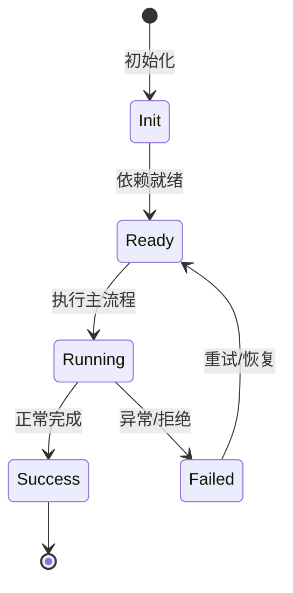

# 权限与审批

权限系统是责任链，工具声明资源访问，policy 决策 approve/ask/deny。

## 责任链

v1 有 19 个 policy，v2 重构为 PermissionPolicy 服务 + veto 事件。

## 模式

manual/yolo/auto 模式；`--yolo` 跳过常规审批，`--auto` 不问用户。

## 资源声明

工具在 resolveExecution 中声明 ToolAccesses（file/all 等），policy 消费这些元数据。

## 设计文档

`packages/agent-core-v2/docs/Permission.md` 详细解释了为什么不引入 Casbin。

## 专业实现要点（开发流程视角）

### 需求分析

Feature 是自包含能力单元，必须能整体安装/卸载而不污染其他模块。

### 设计决策

用 `Feature` 基类组合 Service、Tool、Profile、Config、Command 贡献点；静态契约留在静态注册通道。

### 实现步骤

在 `src/features/<name>/` 写领域代码 → 写 `<name>Feature.ts` → 在 `src/index.ts` 精确导入 → 编写测试。

### 验证方式

通过 `test/features/feature.test.ts` 验证装配/卸载；通过 DI 视图观察 unit 状态。

### 维护注意

不要把所有能力塞进一个 Feature；配置段、wire 事件等静态契约必须保持可重放。

## 逐函数实现说明

以下按源码文件列出可验证的导出函数/类，并给出实现职责说明。

### packages/agent-core/src/agent/permission/index.ts

| 类 | 行号 | 声明 | 实现说明 |
| --- | --- | --- | --- |
| `PermissionManager` | 28 | `export class PermissionManager {` | 该类封装本文模块的核心状态与行为。 |

### packages/agent-core/src/agent/permission/matches-rule.ts

| 函数 | 行号 | 签名 | 实现说明 |
| --- | --- | --- | --- |
| `parsePattern` | 47 | `export function parsePattern(pattern: string): ParsedPattern {` | `parsePattern` 是本文涉及模块中的一个导出函数/类，具体语义以源码实现为准。 |
| `matchPermissionRule` | 75 | `export function matchPermissionRule({` | `matchPermissionRule` 是本文涉及模块中的一个导出函数/类，具体语义以源码实现为准。 |

### packages/agent-core/src/agent/permission/policies/agent-swarm-exclusive-deny.ts

| 类 | 行号 | 声明 | 实现说明 |
| --- | --- | --- | --- |
| `AgentSwarmExclusiveDenyPermissionPolicy` | 3 | `export class AgentSwarmExclusiveDenyPermissionPolicy implements PermissionPolicy {` | 该类封装本文模块的核心状态与行为。 |

### packages/agent-core/src/agent/permission/policies/auto-mode-approve.ts

| 类 | 行号 | 声明 | 实现说明 |
| --- | --- | --- | --- |
| `AutoModeApprovePermissionPolicy` | 4 | `export class AutoModeApprovePermissionPolicy implements PermissionPolicy {` | 该类封装本文模块的核心状态与行为。 |

### packages/agent-core/src/agent/permission/policies/auto-mode-ask-user-question-deny.ts

| 类 | 行号 | 声明 | 实现说明 |
| --- | --- | --- | --- |
| `AutoModeAskUserQuestionDenyPermissionPolicy` | 4 | `export class AutoModeAskUserQuestionDenyPermissionPolicy implements PermissionPolicy {` | 该类封装本文模块的核心状态与行为。 |

### packages/agent-core/src/agent/permission/policies/default-tool-approve.ts

| 类 | 行号 | 声明 | 实现说明 |
| --- | --- | --- | --- |
| `DefaultToolApprovePermissionPolicy` | 28 | `export class DefaultToolApprovePermissionPolicy implements PermissionPolicy {` | 该类封装本文模块的核心状态与行为。 |

### packages/agent-core/src/agent/permission/policies/deny-all.ts

| 类 | 行号 | 声明 | 实现说明 |
| --- | --- | --- | --- |
| `DenyAllPermissionPolicy` | 3 | `export class DenyAllPermissionPolicy implements PermissionPolicy {` | 该类封装本文模块的核心状态与行为。 |

### packages/agent-core/src/agent/permission/policies/exit-plan-mode-review-ask.ts

| 类 | 行号 | 声明 | 实现说明 |
| --- | --- | --- | --- |
| `ExitPlanModeReviewAskPermissionPolicy` | 15 | `export class ExitPlanModeReviewAskPermissionPolicy implements PermissionPolicy {` | 该类封装本文模块的核心状态与行为。 |

### packages/agent-core/src/agent/permission/policies/fallback-ask.ts

| 类 | 行号 | 声明 | 实现说明 |
| --- | --- | --- | --- |
| `FallbackAskPermissionPolicy` | 3 | `export class FallbackAskPermissionPolicy implements PermissionPolicy {` | 该类封装本文模块的核心状态与行为。 |

### packages/agent-core/src/agent/permission/policies/file-access-ask.ts

| 函数 | 行号 | 签名 | 实现说明 |
| --- | --- | --- | --- |
| `writeFileAccesses` | 71 | `export function writeFileAccesses(context: PermissionPolicyContext): ToolFileAccess[] {` | `writeFileAccesses` 负责写入或更新状态。 |

| 类 | 行号 | 声明 | 实现说明 |
| --- | --- | --- | --- |
| `SensitiveFileAccessAskPermissionPolicy` | 14 | `export class SensitiveFileAccessAskPermissionPolicy implements PermissionPolicy {` | 该类封装本文模块的核心状态与行为。 |
| `GitControlPathAccessAskPermissionPolicy` | 29 | `export class GitControlPathAccessAskPermissionPolicy implements PermissionPolicy {` | 该类封装本文模块的核心状态与行为。 |

### packages/agent-core/src/agent/permission/policies/git-cwd-write-approve.ts

| 类 | 行号 | 声明 | 实现说明 |
| --- | --- | --- | --- |
| `GitCwdWriteApprovePermissionPolicy` | 7 | `export class GitCwdWriteApprovePermissionPolicy implements PermissionPolicy {` | 该类封装本文模块的核心状态与行为。 |

### packages/agent-core/src/agent/permission/policies/goal-start-review-ask.ts

| 类 | 行号 | 声明 | 实现说明 |
| --- | --- | --- | --- |
| `GoalStartReviewAskPermissionPolicy` | 17 | `export class GoalStartReviewAskPermissionPolicy implements PermissionPolicy {` | 该类封装本文模块的核心状态与行为。 |

### packages/agent-core/src/agent/permission/policies/index.ts

| 函数 | 行号 | 签名 | 实现说明 |
| --- | --- | --- | --- |
| `createPermissionDecisionPolicies` | 28 | `export function createPermissionDecisionPolicies(agent: Agent): PermissionPolicy[] {` | `createPermissionDecisionPolicies` 负责创建/构建相关对象或流程。 |

### packages/agent-core/src/agent/permission/policies/plan-mode-guard-deny.ts

| 类 | 行号 | 声明 | 实现说明 |
| --- | --- | --- | --- |
| `PlanModeGuardDenyPermissionPolicy` | 5 | `export class PlanModeGuardDenyPermissionPolicy implements PermissionPolicy {` | 该类封装本文模块的核心状态与行为。 |

### packages/agent-core/src/agent/permission/policies/plan-mode-tool-approve.ts

| 类 | 行号 | 声明 | 实现说明 |
| --- | --- | --- | --- |
| `PlanModeToolApprovePermissionPolicy` | 5 | `export class PlanModeToolApprovePermissionPolicy implements PermissionPolicy {` | 该类封装本文模块的核心状态与行为。 |

### packages/agent-core/src/agent/permission/policies/pre-tool-call-hook.ts

| 类 | 行号 | 声明 | 实现说明 |
| --- | --- | --- | --- |
| `PreToolCallHookPermissionPolicy` | 5 | `export class PreToolCallHookPermissionPolicy implements PermissionPolicy {` | 该类封装本文模块的核心状态与行为。 |

### packages/agent-core/src/agent/permission/policies/session-approval-history.ts

| 类 | 行号 | 声明 | 实现说明 |
| --- | --- | --- | --- |
| `SessionApprovalHistoryPermissionPolicy` | 12 | `export class SessionApprovalHistoryPermissionPolicy implements PermissionPolicy {` | 该类封装本文模块的核心状态与行为。 |

### packages/agent-core/src/agent/permission/policies/swarm-mode-agent-swarm-approve.ts

| 类 | 行号 | 声明 | 实现说明 |
| --- | --- | --- | --- |
| `SwarmModeAgentSwarmApprovePermissionPolicy` | 4 | `export class SwarmModeAgentSwarmApprovePermissionPolicy implements PermissionPolicy {` | 该类封装本文模块的核心状态与行为。 |

### packages/agent-core/src/agent/permission/policies/user-configured-rules.ts

| 类 | 行号 | 声明 | 实现说明 |
| --- | --- | --- | --- |
| `UserConfiguredDenyPermissionPolicy` | 44 | `export class UserConfiguredDenyPermissionPolicy` | 该类封装本文模块的核心状态与行为。 |
| `UserConfiguredAllowPermissionPolicy` | 65 | `export class UserConfiguredAllowPermissionPolicy` | 该类封装本文模块的核心状态与行为。 |
| `UserConfiguredAskPermissionPolicy` | 81 | `export class UserConfiguredAskPermissionPolicy` | 该类封装本文模块的核心状态与行为。 |

### packages/agent-core/src/agent/permission/policies/yolo-mode-approve.ts

| 类 | 行号 | 声明 | 实现说明 |
| --- | --- | --- | --- |
| `YoloModeApprovePermissionPolicy` | 4 | `export class YoloModeApprovePermissionPolicy implements PermissionPolicy {` | 该类封装本文模块的核心状态与行为。 |

### packages/agent-core-v2/src/agent/permissionPolicy/permissionPolicyService.ts

| 类 | 行号 | 声明 | 实现说明 |
| --- | --- | --- | --- |
| `AgentPermissionPolicyService` | 24 | `export class AgentPermissionPolicyService` | 该类封装本文模块的核心状态与行为。 |

### packages/agent-core-v2/src/agent/permissionPolicy/policies/auto-mode-approve.ts

| 类 | 行号 | 声明 | 实现说明 |
| --- | --- | --- | --- |
| `AutoModeApprovePermissionPolicyService` | 7 | `export class AutoModeApprovePermissionPolicyService implements PermissionPolicy {` | 该类封装本文模块的核心状态与行为。 |

### packages/agent-core-v2/src/agent/permissionPolicy/policies/auto-mode-ask-user-question-deny.ts

| 类 | 行号 | 声明 | 实现说明 |
| --- | --- | --- | --- |
| `AutoModeAskUserQuestionDenyPermissionPolicyService` | 8 | `export class AutoModeAskUserQuestionDenyPermissionPolicyService implements PermissionPolicy {` | 该类封装本文模块的核心状态与行为。 |

### packages/agent-core-v2/src/agent/permissionPolicy/policies/default-tool-approve.ts

| 类 | 行号 | 声明 | 实现说明 |
| --- | --- | --- | --- |
| `DefaultToolApprovePermissionPolicyService` | 33 | `export class DefaultToolApprovePermissionPolicyService implements PermissionPolicy {` | 该类封装本文模块的核心状态与行为。 |

### packages/agent-core-v2/src/agent/permissionPolicy/policies/fallback-ask.ts

| 类 | 行号 | 声明 | 实现说明 |
| --- | --- | --- | --- |
| `FallbackAskPermissionPolicyService` | 6 | `export class FallbackAskPermissionPolicyService implements PermissionPolicy {` | 该类封装本文模块的核心状态与行为。 |

### packages/agent-core-v2/src/agent/permissionPolicy/policies/git-control-path-access-ask.ts

| 类 | 行号 | 声明 | 实现说明 |
| --- | --- | --- | --- |
| `GitControlPathAccessAskPermissionPolicyService` | 17 | `export class GitControlPathAccessAskPermissionPolicyService implements PermissionPolicy {` | 该类封装本文模块的核心状态与行为。 |

### packages/agent-core-v2/src/agent/permissionPolicy/policies/git-cwd-write-approve.ts

| 类 | 行号 | 声明 | 实现说明 |
| --- | --- | --- | --- |
| `GitCwdWriteApprovePermissionPolicyService` | 14 | `export class GitCwdWriteApprovePermissionPolicyService implements PermissionPolicy {` | 该类封装本文模块的核心状态与行为。 |

### packages/agent-core-v2/src/agent/permissionPolicy/policies/path-utils.ts

| 函数 | 行号 | 签名 | 实现说明 |
| --- | --- | --- | --- |
| `fileAccesses` | 12 | `export function fileAccesses(context: ResolvedToolExecutionHookContext): ToolFileAccess[] {` | `fileAccesses` 是本文涉及模块中的一个导出函数/类，具体语义以源码实现为准。 |
| `writeFileAccesses` | 19 | `export function writeFileAccesses(context: ResolvedToolExecutionHookContext): ToolFileAccess[] {` | `writeFileAccesses` 负责写入或更新状态。 |
| `hasGitPathComponent` | 25 | `export function hasGitPathComponent(` | `hasGitPathComponent` 是本文涉及模块中的一个导出函数/类，具体语义以源码实现为准。 |
| `isGitControlPath` | 35 | `export function isGitControlPath(` | `isGitControlPath` 是本文涉及模块中的一个导出函数/类，具体语义以源码实现为准。 |
| `defaultPathClass` | 46 | `export function defaultPathClass(): PathClass {` | `defaultPathClass` 是本文涉及模块中的一个导出函数/类，具体语义以源码实现为准。 |

### packages/agent-core-v2/src/agent/permissionPolicy/policies/sensitive-file-access-ask.ts

| 类 | 行号 | 声明 | 实现说明 |
| --- | --- | --- | --- |
| `SensitiveFileAccessAskPermissionPolicyService` | 9 | `export class SensitiveFileAccessAskPermissionPolicyService implements PermissionPolicy {` | 该类封装本文模块的核心状态与行为。 |

### packages/agent-core-v2/src/agent/permissionPolicy/policies/session-approval-history.ts

| 类 | 行号 | 声明 | 实现说明 |
| --- | --- | --- | --- |
| `SessionApprovalHistoryPermissionPolicyService` | 9 | `export class SessionApprovalHistoryPermissionPolicyService implements PermissionPolicy {` | 该类封装本文模块的核心状态与行为。 |

### packages/agent-core-v2/src/agent/permissionPolicy/policies/user-configured-allow.ts

| 类 | 行号 | 声明 | 实现说明 |
| --- | --- | --- | --- |
| `UserConfiguredAllowPermissionPolicyService` | 9 | `export class UserConfiguredAllowPermissionPolicyService implements PermissionPolicy {` | 该类封装本文模块的核心状态与行为。 |

### packages/agent-core-v2/src/agent/permissionPolicy/policies/user-configured-ask.ts

| 类 | 行号 | 声明 | 实现说明 |
| --- | --- | --- | --- |
| `UserConfiguredAskPermissionPolicyService` | 9 | `export class UserConfiguredAskPermissionPolicyService implements PermissionPolicy {` | 该类封装本文模块的核心状态与行为。 |

### packages/agent-core-v2/src/agent/permissionPolicy/policies/user-configured-deny.ts

| 类 | 行号 | 声明 | 实现说明 |
| --- | --- | --- | --- |
| `UserConfiguredDenyPermissionPolicyService` | 9 | `export class UserConfiguredDenyPermissionPolicyService implements PermissionPolicy {` | 该类封装本文模块的核心状态与行为。 |

### packages/agent-core-v2/src/agent/permissionPolicy/policies/user-configured-rule.ts

| 函数 | 行号 | 签名 | 实现说明 |
| --- | --- | --- | --- |
| `evaluateUserConfiguredRule` | 20 | `export function evaluateUserConfiguredRule(` | `evaluateUserConfiguredRule` 是本文涉及模块中的一个导出函数/类，具体语义以源码实现为准。 |

### packages/agent-core-v2/src/agent/permissionPolicy/policies/yolo-mode-approve.ts

| 类 | 行号 | 声明 | 实现说明 |
| --- | --- | --- | --- |
| `YoloModeApprovePermissionPolicyService` | 7 | `export class YoloModeApprovePermissionPolicyService implements PermissionPolicy {` | 该类封装本文模块的核心状态与行为。 |


## 核心代码片段

以下片段直接从仓库源码截取，用于展示关键实现形态；完整实现请打开对应文件。

### 来自 `packages/agent-core/src/agent/permission/index.ts` 的 `PermissionManager`

源码位置：`packages/agent-core/src/agent/permission/index.ts:28` 附近。

```ts
export class PermissionManager {
  readonly policies: PermissionPolicy[];
  readonly rules: PermissionRule[] = [];
  private modeOverride: PermissionMode | undefined;
  private readonly parent: PermissionManager | undefined;
  private readonly localSessionApprovalRulePatterns = new Set<string>();

  constructor(
    protected readonly agent: Agent,
    options: PermissionManagerOptions = {},
  ) {
    this.rules = [...(options.initialRules ?? [])];
    this.parent = options.parent;
    this.policies = createPermissionDecisionPolicies(this.agent);
  }

  get mode(): PermissionMode {
    return this.modeOverride ?? this.parent?.mode ?? 'manual';
  }

  set mode(mode: PermissionMode) {
    this.modeOverride = mode;
  }

// ...
```

### 来自 `packages/agent-core/src/agent/permission/matches-rule.ts` 的 `parsePattern`

源码位置：`packages/agent-core/src/agent/permission/matches-rule.ts:47` 附近。

```ts
export function parsePattern(pattern: string): ParsedPattern {
  const trimmed = pattern.trim();
  if (trimmed.length === 0) {
    throw new Error('permission pattern: empty string');
  }

  const openIdx = trimmed.indexOf('(');
  if (openIdx === -1) {
    return { toolName: trimmed };
  }

  if (!trimmed.endsWith(')')) {
    throw new Error(`permission pattern: missing closing paren in "${pattern}"`);
  }

  const toolName = trimmed.slice(0, openIdx);
  const argPattern = trimmed.slice(openIdx + 1, -1);
  if (toolName.length === 0) {
    throw new Error(`permission pattern: empty tool name in "${pattern}"`);
  }
  // `Tool()` parses to no arg pattern so it stays tool-name-only — tools without
  // a `matchesRule` matcher (user/MCP/custom) would otherwise stop matching it.
  if (argPattern.length === 0) {
    return { toolName };
// ...
```

### 来自 `packages/agent-core/src/agent/permission/policies/agent-swarm-exclusive-deny.ts` 的 `AgentSwarmExclusiveDenyPermissionPolicy`

源码位置：`packages/agent-core/src/agent/permission/policies/agent-swarm-exclusive-deny.ts:3` 附近。

```ts
export class AgentSwarmExclusiveDenyPermissionPolicy implements PermissionPolicy {
  readonly name = 'agent-swarm-exclusive-deny';

  evaluate(context: PermissionPolicyContext): PermissionPolicyResult | undefined {
    const toolCalls = context.toolCalls;
    const agentSwarmCount = toolCalls.filter(
      (toolCall) => toolCall.name === 'AgentSwarm',
    ).length;

    if (agentSwarmCount === 0) return;
    if (agentSwarmCount === 1 && toolCalls.length === 1) return;

    return {
      kind: 'deny',
      message:
        agentSwarmCount > 1
          ? multipleAgentSwarmDeniedMessage(toolCalls.length > agentSwarmCount)
          : mixedAgentSwarmDeniedMessage(),
      reason: {
        agent_swarm_tool_calls: agentSwarmCount,
        tool_calls: toolCalls.length,
      },
    };
  }
// ...
```


## 时序/状态图



> 图注：`04-features/permissions.md` 的抽象流程；具体参与者与状态以源码和上文函数说明为准。

## 核心实现细节（源码导出）

以下是本文涉及路径中的真实源码导出/结构，帮助你把概念映射到函数、类与方法：

  - `packages/agent-core/src/agent/permission//` 目录下源码文件示例：
    - `packages/agent-core/src/agent/permission/index.ts`
    - `packages/agent-core/src/agent/permission/matches-rule.ts`
    - `packages/agent-core/src/agent/permission/policies/agent-swarm-exclusive-deny.ts`
    - `packages/agent-core/src/agent/permission/policies/auto-mode-approve.ts`
    - `packages/agent-core/src/agent/permission/policies/auto-mode-ask-user-question-deny.ts`
    - `packages/agent-core/src/agent/permission/policies/default-tool-approve.ts`
    - `packages/agent-core/src/agent/permission/policies/deny-all.ts`
    - `packages/agent-core/src/agent/permission/policies/exit-plan-mode-review-ask.ts`
    - `packages/agent-core/src/agent/permission/policies/fallback-ask.ts`
    - `packages/agent-core/src/agent/permission/policies/file-access-ask.ts`
    - `packages/agent-core/src/agent/permission/policies/git-cwd-write-approve.ts`
    - `packages/agent-core/src/agent/permission/policies/goal-start-review-ask.ts`
    - `packages/agent-core/src/agent/permission/policies/index.ts`
    - `packages/agent-core/src/agent/permission/policies/plan-mode-guard-deny.ts`
    - `packages/agent-core/src/agent/permission/policies/plan-mode-tool-approve.ts`
    - `packages/agent-core/src/agent/permission/policies/pre-tool-call-hook.ts`
    - `packages/agent-core/src/agent/permission/policies/session-approval-history.ts`
    - `packages/agent-core/src/agent/permission/policies/swarm-mode-agent-swarm-approve.ts`
    - `packages/agent-core/src/agent/permission/policies/user-configured-rules.ts`
    - `packages/agent-core/src/agent/permission/policies/yolo-mode-approve.ts`
    - `packages/agent-core/src/agent/permission/types.ts`
  - `packages/agent-core-v2/src/agent/permissionPolicy//` 目录下源码文件示例：
    - `packages/agent-core-v2/src/agent/permissionPolicy/permissionPolicy.ts`
    - `packages/agent-core-v2/src/agent/permissionPolicy/permissionPolicyService.ts`
    - `packages/agent-core-v2/src/agent/permissionPolicy/policies/auto-mode-approve.ts`
    - `packages/agent-core-v2/src/agent/permissionPolicy/policies/auto-mode-ask-user-question-deny.ts`
    - `packages/agent-core-v2/src/agent/permissionPolicy/policies/default-tool-approve.ts`
    - `packages/agent-core-v2/src/agent/permissionPolicy/policies/fallback-ask.ts`
    - `packages/agent-core-v2/src/agent/permissionPolicy/policies/git-control-path-access-ask.ts`
    - `packages/agent-core-v2/src/agent/permissionPolicy/policies/git-cwd-write-approve.ts`
    - `packages/agent-core-v2/src/agent/permissionPolicy/policies/path-utils.ts`
    - `packages/agent-core-v2/src/agent/permissionPolicy/policies/sensitive-file-access-ask.ts`
    - `packages/agent-core-v2/src/agent/permissionPolicy/policies/session-approval-history.ts`
    - `packages/agent-core-v2/src/agent/permissionPolicy/policies/user-configured-allow.ts`
    - `packages/agent-core-v2/src/agent/permissionPolicy/policies/user-configured-ask.ts`
    - `packages/agent-core-v2/src/agent/permissionPolicy/policies/user-configured-deny.ts`
    - `packages/agent-core-v2/src/agent/permissionPolicy/policies/user-configured-rule.ts`
    - `packages/agent-core-v2/src/agent/permissionPolicy/policies/yolo-mode-approve.ts`
    - `packages/agent-core-v2/src/agent/permissionPolicy/types.ts`
  - `packages/agent-core-v2/docs/Permission.md`（非 TS 源码，可直接阅读）

## 证据与代码位置

- `packages/agent-core/src/agent/permission/`
- `packages/agent-core-v2/src/agent/permissionPolicy/`
- `packages/agent-core-v2/docs/Permission.md`

> 本文所有路径均相对仓库根目录；引用内容以仓库当前 `HEAD` 为准。
