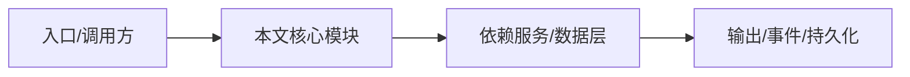

# NightHawk Vibe Coding 指南

Vibe Coding 是一种“用自然语言描述产品/功能，让 AI Agent 自主完成编码”的开发方式。NightHawk 很适合 vibe coding，因为它同时具备：

- 现代 coding agent 内核：Turn/Step、工具调用、子 Agent、Skills、MCP
- 原生安全引擎：写完代码后可以直接让 Agent 审计
- 多种运行形态：终端 TUI、headless CLI、VS Code、Server/Web
- 可编程的权限模式：`--yolo`、`--auto`、`--plan`

本目录提供：

| 文档 | 内容 |
| --- | --- |
| `README.md` | Vibe Coding 总览 |
| `prompt-library.md` | 可直接复制的高质量提示词库 |
| `workflow.md` | 从想法到上线的完整开发流程 |
| `security-review.md` | Vibe Coding 后的安全审计提示词 |
| `prompt-engineering.md` | 如何写出让 NightHawk 稳定执行的提示词 |

## 快速开始

```sh
# 交互式 vibe coding
cd your-project
nighthawk

# 无头 vibe coding，适合脚本/CI
nighthawk -p "用 TypeScript 实现一个 markdown 转 HTML 的 CLI，包含测试"
```

## 核心建议

1. **先 Plan 再 Act**：复杂功能用 `nighthawk --plan` 或 `/plan`。
2. **明确验收标准**：提示词里写清楚“完成标准”和“不要做什么”。
3. **写完必须审计**：用 `SecurityScan`、`TaintTrace` 做安全复查。
4. **小步提交**：让 Agent 每完成一个可验证切片就运行测试。
5. **善用 Skills/AGENTS.md**：把项目规范写进 `AGENTS.md`，vibe coding 会更稳定。

## 逐函数实现说明

以下按源码文件列出可验证的导出函数/类，并给出实现职责说明。


## 核心代码片段

以下片段直接从仓库源码截取，用于展示关键实现形态；完整实现请打开对应文件。

> 本文证据路径没有可直接展示的 TS 源码片段。

## 时序/状态图



> 图注：`13-vibe-coding/README.md` 的抽象流程；具体参与者与状态以源码和上文函数说明为准。

## 专业实现要点（开发流程视角）

### 需求分析

Vibe Coding 文档要把“自然语言开发”变成可重复、可验证、安全可控的工程流程。

### 设计决策

以提示词模板、阶段化工作流、安全审计清单为核心，让用户可以直接复制使用。

### 实现步骤

从项目准备 → 需求澄清 → 方案设计 → 小步实现 → 审查 → 安全审计 → 提交 → 迭代。

### 验证方式

每个提示词都要求 Agent 运行测试、lint、安全工具；文档本身引用 NightHawk 真实命令。

### 维护注意

提示词应随 NightHawk 工具集和权限模式演进，避免使用已废弃命令。

## 核心实现细节（源码导出）

以下是本文涉及路径中的真实源码导出/结构，帮助你把概念映射到函数、类与方法：

  - `README.zh-CN.md`（非 TS 源码，可直接阅读）
  - `docs/en/guides/getting-started.md`（非 TS 源码，可直接阅读）
  - `docs/en/reference/nighthawk-command.md`（非 TS 源码，可直接阅读）
  - `docs/en/reference/tools.md`（非 TS 源码，可直接阅读）
  - `project-encyclopedia/04-features//`（目录内无 .ts 文件）
  - `project-encyclopedia/05-security//`（目录内无 .ts 文件）

## 证据与代码位置

- `README.zh-CN.md`
- `docs/en/guides/getting-started.md`
- `docs/en/reference/nighthawk-command.md`
- `docs/en/reference/tools.md`
- `project-encyclopedia/04-features/`
- `project-encyclopedia/05-security/`
