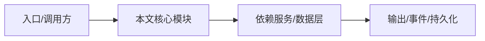

# 约束强制执行机制

要让约束不是“建议”，而是“必须”，需要结合 NightHawk 的权限、Hook、测试、CI 和文档。

## 1. 权限模式

| 模式 | 效果 | 适用 |
| --- | --- | --- |
| 默认 | 写文件/执行命令需要审批 | 日常开发 |
| `--yolo` | 跳过常规审批 | 可信项目批量任务 |
| `--auto` | 完全自主，不问用户 | 流水线，但需静态 deny 规则 |
| `--plan` | 只读探索，先计划 | 复杂任务 |

约束：

```text
除非用户明确使用 --yolo 或 --auto，否则所有写操作必须经过审批。
```

## 2. 用户配置规则

在 `config.toml` 中配置 allow/ask/deny：

```toml
[permissions]
rules = [
  { pattern = "Bash", deny = true, reason = "禁止直接执行危险命令" },
  { pattern = "Write", ask = true, reason = "写文件必须确认" }
]
```

## 3. Hooks

使用生命周期 Hook 在工具执行前拦截：

```text
PreToolUse:
- 如果命令包含 rm -rf /、curl | sh，返回 block。
- 如果写文件路径不在工作区内，返回 block。
```

参考 `docs/en/customization/hooks.md`。

## 4. 测试与 CI

```sh
pnpm lint
pnpm typecheck
pnpm test
node scripts/smoke-security.ts
```

CI 中增加：

- 禁止提交 `.env` 的检查
- 禁止硬编码密钥的检查
- 必须运行测试
- 文档与代码同步检查

## 5. AGENTS.md 作为第一道约束

```markdown
## 强制规则

- 如果某个操作违反 AGENTS.md，必须停下并说明。
- 不要为了完成任务而绕过约束。
- 当指令冲突时，以更严格的约束为准。
```

## 6. 提示词：要求 Agent 自证遵守

```text
完成前请自检：
1. 是否修改了无关文件？
2. 是否引入了未授权依赖？
3. 是否包含敏感信息？
4. 是否运行了测试？
5. 是否遵守了 AGENTS.md 约束？

如果任何一项不满足，先修正再汇报。
```

## 逐函数实现说明

以下按源码文件列出可验证的导出函数/类，并给出实现职责说明。


## 核心代码片段

以下片段直接从仓库源码截取，用于展示关键实现形态；完整实现请打开对应文件。

> 本文证据路径没有可直接展示的 TS 源码片段。

## 时序/状态图



> 图注：`14-prompts-constraints/enforcement.md` 的抽象流程；具体参与者与状态以源码和上文函数说明为准。

## 核心实现细节（源码导出）

以下是本文涉及路径中的真实源码导出/结构，帮助你把概念映射到函数、类与方法：

  - `docs/en/customization/hooks.md`（非 TS 源码，可直接阅读）
  - `docs/en/configuration/config-files.md`（非 TS 源码，可直接阅读）
  - `project-encyclopedia/04-features/permissions.md`（非 TS 源码，可直接阅读）
  - `project-encyclopedia/04-features/hooks.md`（非 TS 源码，可直接阅读）
  - `project-encyclopedia/08-development/linting.md`（非 TS 源码，可直接阅读）

## 证据与代码位置

- `docs/en/customization/hooks.md`
- `docs/en/configuration/config-files.md`
- `project-encyclopedia/04-features/permissions.md`
- `project-encyclopedia/04-features/hooks.md`
- `project-encyclopedia/08-development/linting.md`
