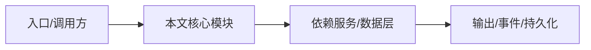

# 全局约束

以下约束适用于所有 NightHawk 编码任务。建议原样放入项目根目录 `AGENTS.md`。

## 1. 代码与修改约束

```markdown
## 约束（必须遵守）

- 只修改与当前任务直接相关的文件。
- 不顺手重构无关代码。
- 不升级依赖，除非任务明确要求。
- 不改变公共 API，除非先说明并得到确认。
- 不删除或重命名文件，除非任务要求。
- 新功能必须包含测试。
- 修改后必须运行相关测试、lint、typecheck。
```

## 2. 安全约束

```markdown
## 安全约束（必须遵守）

- 禁止把用户输入直接拼进 SQL / shell / HTML。
- 禁止使用 eval、Function、child_process shell=True。
- 禁止硬编码密钥、token、密码。
- 禁止提交 .env 或包含真实凭据的文件。
- 禁止访问工作区之外的敏感路径，除非用户明确授权。
- 禁止执行未授权渗透测试。
- 使用参数化查询、输出编码、最小权限。
```

## 3. 工作流约束

```markdown
## 工作流约束

- 复杂任务先给计划，确认后再实现。
- 每完成一个可验证切片就运行测试。
- 失败先读日志定位根因，不盲目重试。
- 提交信息遵循 Conventional Commit。
- 不提交 scratch 文件、设计稿、handoff 文档。
- 不泄露真实内部标识，使用 example 占位符。
```

## 4. 项目规范约束

```markdown
## 项目规范

- 严格遵循 AGENTS.md 和目录内 README/文档。
- 优先复用现有工具、服务、组件。
- 遵循项目的代码风格、命名、目录结构。
- 不引入新的构建工具，除非任务明确要求。
- 公共导出变更必须同步类型和文档。
```

## 5. 提示词模板：要求 Agent 遵守

```text
请严格遵循 AGENTS.md 中的全部约束。
如果某个约束与我的新指令冲突，先停下来说明冲突，不要自行决定。
```

## 逐函数实现说明

以下按源码文件列出可验证的导出函数/类，并给出实现职责说明。


## 核心代码片段

以下片段直接从仓库源码截取，用于展示关键实现形态；完整实现请打开对应文件。

> 本文证据路径没有可直接展示的 TS 源码片段。

## 时序/状态图



> 图注：`14-prompts-constraints/global-constraints.md` 的抽象流程；具体参与者与状态以源码和上文函数说明为准。

## 核心实现细节（源码导出）

以下是本文涉及路径中的真实源码导出/结构，帮助你把概念映射到函数、类与方法：

  - `AGENTS.md`（非 TS 源码，可直接阅读）
  - `CONTRIBUTING.md`（非 TS 源码，可直接阅读）
  - `docs/en/customization/agents.md`（非 TS 源码，可直接阅读）
  - `project-encyclopedia/08-development/full-development-process.md`（非 TS 源码，可直接阅读）

## 证据与代码位置

- `AGENTS.md`
- `CONTRIBUTING.md`
- `docs/en/customization/agents.md`
- `project-encyclopedia/08-development/full-development-process.md`
