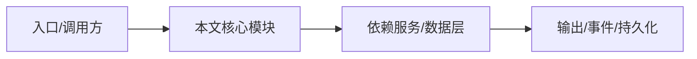

# 功能级提示词与约束

本文为 NightHawk 每个主要功能/工具提供“提示词 + 约束”，可以直接复制到 TUI、`nighthawk -p` 或写入 `AGENTS.md`。

## 文件工具

### Read

```text
请使用 Read 读取 [文件]，只读取任务需要的部分。
约束：
- 不修改文件。
- 不读取包含密钥/凭据的敏感文件，除非任务明确要求。
```

### Write / Edit

```text
请实现/修改 [文件]。
约束：
- 先 Read 再 Edit。
- 保持文件原有风格。
- 不覆盖未读过的文件。
- 修改后运行相关测试。
```

### Grep / Glob

```text
请搜索 [关键词/模式]。
约束：
- 跳过 node_modules、dist、.git。
- 只返回与任务相关的结果。
```

## 执行工具

### Bash

```text
请运行 [命令]。
约束：
- 不执行危险命令（rm -rf /、curl | sh、sudo）。
- 不访问工作区外路径，除非明确授权。
- 优先使用参数化/数组形式，避免 shell 注入。
```

## Agent 工具

### Agent / 子 Agent

```text
请使用子 Agent 并行调研 [任务]。
约束：
- 子 Agent 不修改主上下文。
- 子 Agent 不执行高风险操作，除非主 Agent 明确授权。
- 子 Agent 结果必须汇总回主 Agent。
```

### AskUserQuestion

```text
在关键决策点使用 AskUserQuestion 向我确认。
约束：
- 不要用提问代替必要的代码阅读。
- 一次最多问必要的问题。
```

## 计划与任务

### Plan 模式

```text
请先进入 Plan 模式，只读探索并输出计划。
约束：
- 不修改文件。
- 计划必须包含涉及文件、步骤、验证方式。
```

### TodoList

```text
请维护 TodoList。
约束：
- 每个子任务完成后更新状态。
- 不把模糊目标写成 todo。
- 完成后清理 todo。
```

## MCP

```text
请使用 MCP server [名称] 完成 [任务]。
约束：
- 不把 MCP 返回的敏感数据写入日志。
- 不调用未启用的 MCP server。
- 工具调用失败时先读错误，不盲重试。
```

## Skills

```text
请加载 [skill] 并按其流程执行。
约束：
- 不跳过 skill 中的验证步骤。
- skill 与 AGENTS.md 冲突时，先报告冲突。
```

## 安全工具

### SecurityScan

```text
请对 [路径] 执行 SecurityScan。
约束：
- 按严重度排序输出。
- 每条发现给出 file:line 和修复建议。
- 不把疑似问题当确认漏洞。
```

### SecretScan

```text
请对 [路径] 执行 SecretScan。
约束：
- 不输出完整密钥内容，只输出类型/位置/置信度。
- 发现密钥后建议轮换，不直接打印。
```

### TaintTrace

```text
请对 [入口文件] 执行 TaintTrace，scope 使用 module。
约束：
- 只报告可追溯的数据流。
- 输出 source、sink、varName、flow。
```

### DepAudit

```text
请对 [目录] 执行 DepAudit。
约束：
- 区分 offline / osv / external 来源。
- 对 postinstall 脚本和未锁定版本重点提示。
```

## 逐函数实现说明

以下按源码文件列出可验证的导出函数/类，并给出实现职责说明。


## 核心代码片段

以下片段直接从仓库源码截取，用于展示关键实现形态；完整实现请打开对应文件。

> 本文证据路径没有可直接展示的 TS 源码片段。

## 时序/状态图



> 图注：`14-prompts-constraints/per-feature-prompts.md` 的抽象流程；具体参与者与状态以源码和上文函数说明为准。

## 核心实现细节（源码导出）

以下是本文涉及路径中的真实源码导出/结构，帮助你把概念映射到函数、类与方法：

  - `docs/en/reference/tools.md`（非 TS 源码，可直接阅读）
  - `docs/en/reference/slash-commands.md`（非 TS 源码，可直接阅读）
  - `project-encyclopedia/04-features//`（目录内无 .ts 文件）
  - `project-encyclopedia/05-security//`（目录内无 .ts 文件）
  - `project-encyclopedia/13-vibe-coding/prompt-library.md`（非 TS 源码，可直接阅读）

## 证据与代码位置

- `docs/en/reference/tools.md`
- `docs/en/reference/slash-commands.md`
- `project-encyclopedia/04-features/`
- `project-encyclopedia/05-security/`
- `project-encyclopedia/13-vibe-coding/prompt-library.md`
